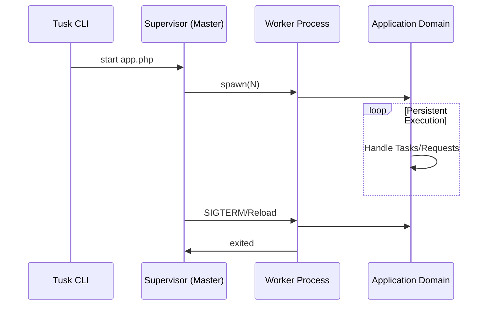

# Tusk Runtime Technical Spec (v0.1)

## Overview
The **Tusk Runtime** is responsible for turning a PHP application into a persistent process. It manages the lifecycle of workers, handles signals, and integrates with the event loop.

## Core Components

### 1. The Runner (`tusk run`)
The main entry point that:
- Initializes the `Tusk Container`.
- Boots the configured `Runtime Adapter` (e.g., RoadRunner, Swoole, or native PHP loop).
- Sets up signal handlers (`SIGTERM`, `SIGINT`).

### 2. Supervisor & Worker Management
Inspired by Erlang/Spring, Tusk manages a pool of workers:
- **Master Process**: Remains lean, monitors child workers.
- **Worker Processes**: Execute the application logic (Domain).
- **Auto-Restart**: If a worker crashes, the Supervisor replaces it immediately.

### 3. Event Loop Integration
Tusk aims to be runtime-agnostic but optimized for modern engines:
- **Phase 1**: Support for **RoadRunner** (via RPC) and **Swoole**.
- **Phase 2**: Native PHP fibers-based loop for isolated tasks.

## Application Lifecycle in Runtime



## Configuration

```php
#[Runtime(
    workers: 4,
    max_requests: 1000,
    dispatch_mode: 'round-robin'
)]
class AppRuntime {}
```

## Error Handling & Reliability
- **Isolate Crashes**: A fatal error in one worker does not kill the entire application.
- **Graceful Shutdown**: Ensures inflight requests/tasks are finished (or timed out) before exiting.

---
*Status: Draft v0.1*
