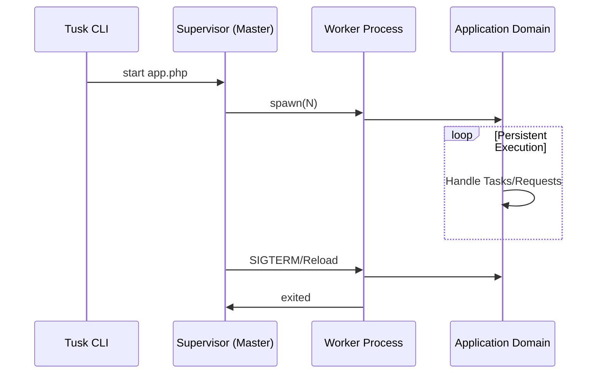

# Tusk Runtime Technical Spec (v0.2)

## Overview
The **Tusk Runtime** is responsible for turning a PHP application into a persistent process. It manages the lifecycle of workers, handles signals, and integrates with the event loop.

## Core Components

### 1. The Runner (`tusk run`)
The main entry point that:
- Initializes the `Tusk Container`.
- Boots the configured `Runtime Adapter` (e.g., RoadRunner, Swoole, or native PHP loop).
- Sets up signal handlers (`SIGTERM`, `SIGINT`).

### 2. Lifecycle Control Plane

`Tusk\Runtime\LifecycleManager` owns application, worker, and request transitions. The Kernel starts the application and worker, wraps the transport handler, and always performs worker/application teardown when the adapter exits. Request cleanup runs exactly once in a `finally` path and preserves the handler's original exception when cleanup also fails.

Runtime adapters own only transport and blocking concerns. RoadRunner is the primary transport; the native NDJSON loop remains a compatibility adapter. Neither adapter creates or resets container scopes.

### 3. Runtime ownership

The Tusk Engine is the Go control plane. It generates and validates runtime configuration, starts and monitors RoadRunner, exposes health/log/metric control-plane behavior, and performs graceful reload/stop. RoadRunner owns worker pools, supervision, recycling, and Goridge IPC. Tusk PHP modules never create a second worker pool or proxy.

The PHP runtime exposes RoadRunner functionality through provider-neutral Tusk contracts. A capability registry resolves declared services lazily and caches them for the worker lifetime. The first-party capability set is:

| Tusk contract | RoadRunner plugin | Scope |
| --- | --- | --- |
| `QueueInterface` | `jobs` | producer; consumer boundary is separate |
| `KeyValueStoreInterface` | `kv` | worker |
| `LockInterface` | `lock` | process/worker instance |
| `MetricsInterface` | `metrics` | worker |
| `Psr\Log\LoggerInterface` | `logger` | worker |

All RPC-backed capabilities share one RPC factory per worker. `RR_RPC` is supplied by RoadRunner; plugin configuration remains in `.rr.yaml`.

### 4. Worker modes

HTTP is the default worker mode and is exposed through the compatibility `RoadRunnerAdapter` backed by `RoadRunnerHttpModule`. gRPC has an explicit `RoadRunnerGrpcModule` service registry. Both preserve the same application/worker lifecycle; the transport does not own lifecycle state.

The native NDJSON adapter is an explicit migration boundary. It remains useful for compatibility and protocol tests, but it does not implement RoadRunner capabilities.

### 5. Observability and diagnostics

Observability is a runtime module with a no-op provider by default. The module is registered consistently so application services can depend on provider-neutral Tusk contracts without coupling container compilation to a specific exporter.

The runtime emits lifecycle boundaries for application start/stop, worker start/stop, HTTP requests, and queue jobs. WorkerDiagnosticsSnapshot is the stable local/control-plane data shape for counters, durations, memory, lifecycle state, and sanitized failure metadata. It never includes request headers, cookies, bodies, uploads, credentials, tokens, or exception stack traces.

OpenTelemetry is an optional bridge selected through configuration. The first exporter is OTLP over HTTP; exporter and transport failures are recorded and must not replace the application or lifecycle exception that triggered them. The CLI command runtime:diagnostics renders the current process snapshot only. Remote worker health and aggregated fleet state belong to the Tusk Engine control plane.

## Application Lifecycle in Runtime


```mermaid
sequenceDiagram
    participant CLI as Tusk CLI
    participant Master as Supervisor (Master)
    participant Worker as Worker Process
    participant App as Application Domain

    CLI->>Master: start app.php
    Master->>Worker: spawn(N)
    Worker->>App: #[OnStart]
    loop Persistent Execution
        App->>App: Handle Tasks/Requests
    end
    Master->>Worker: SIGTERM/Reload
    Worker->>App: #[OnShutdown]
    Worker->>Master: exited
```

The transport-neutral lifecycle sequence is:

```text
application.start -> worker.start -> (request.start -> handler -> request.end)*
worker.stop -> application.stop
```

Each transition is idempotent where meaningful, while impossible transitions fail explicitly. Teardown hooks continue in declaration order after a hook failure and report the first failure after all hooks have had an opportunity to run.

## Configuration

```php
return [
    'runtime' => [
        'adapter' => 'roadrunner',
        'modules' => ['http', 'capabilities.kv', 'capabilities.metrics'],
    ],
];
```

This selects Tusk modules only. Drivers, endpoints, pools, TLS, and logger output remain in `.rr.yaml`. The `tusk-engine`/RoadRunner process is responsible for the runtime mechanics.

## Error Handling & Reliability
- **Isolate Crashes**: A fatal error in one worker does not kill the entire application.
- **Graceful Shutdown**: Ensures inflight requests/tasks are finished (or timed out) before exiting.
- **Capability failures**: Missing providers or RoadRunner plugins fail with the capability name and remediation instead of silently falling back.

Temporal is intentionally reserved as a future capability and worker-mode extension; it is not part of the current RoadRunner module set.

---
*Status: Draft v0.2*
